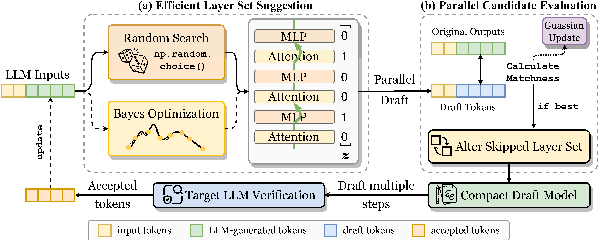

<div align="center"><h1>&nbsp;SWIFT: On-the-Fly Self-Speculative Decoding for LLM Inference Acceleration</h1></div>
<p align="center">
<a href="">
  </a> 
<a href="https://opensource.org/licenses/Apache-2.0">
  </a> 
<a href="https://github.com/hemingkx/SWIFT/pulls">
    </a>
</p>


## Introduction

SWIFT is an **on-the-fly self-speculative decoding** algorithm that adaptively selects intermediate layers of LLMs to skip during inference. This method **does not require auxiliary models or additional training**, making it a *plug-and-play* and *cost-effective* solution for accelerating LLM inference. 

SWIFT divides LLM inference into two distinct phases:

- **Optimization phase:** Identify the optimal skipped layer set given the input data stream.
- **Acceleration phase:** Employ the determined configuration to accelerate LLM inference.

During the optimization stage, SWIFT performs an optimization step prior to each LLM decoding step to adjust the skipped layer set, which involves: **a)** Efficient layer set optimization. SWIFT integrates random search with interval Bayesian optimization to propose layer set candidates efficiently; **b)** Parallel candidate evaluation. SWIFT uses LLM-generated tokens as ground truth, enabling simultaneous validation of the proposed candidates. The best-performing layer set is selected to accelerate the current decoding step.



## Installation

```
conda create -n swift python=3.9
conda activate swift
cd SWIFT
pip install -r requirements.txt
```

## Inference

Run command lines in `eval_llama.sh`, the results will be stored in `test/.../model_answer/`.

```
./eval_llama.sh
```

## Speedup Report

Obtain the corresponding speedup compared to vanilla autoregressive decoding.

```
python evaluation_llama/speed.py --file-path /your_own_path/swift.jsonl --base-path /your_own_path/llama_vanilla.jsonl
```

## Acknowledgments

This codebase is built from [Self-SD](https://github.com/dilab-zju/self-speculative-decoding) and [EAGLE](https://github.com/SafeAILab/EAGLE). The logo is designed by GPT-4.

## Citation

If you find the resources in this repository useful, please cite our paper:

```
@misc{xia2024swift,
      title={SWIFT: On-the-Fly Self-Speculative Decoding for LLM Inference Acceleration}, 
      author={Heming Xia and Yongqi Li and Jun Zhang and Cunxiao Du and Wenjie Li},
      year={2024},
}
```

